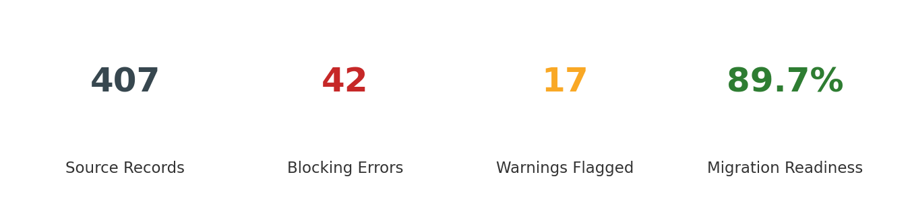
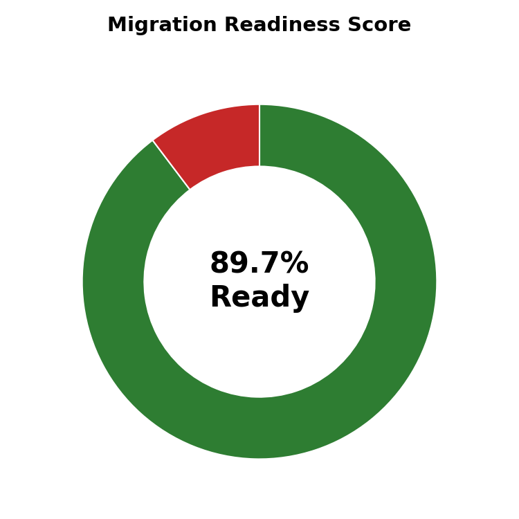
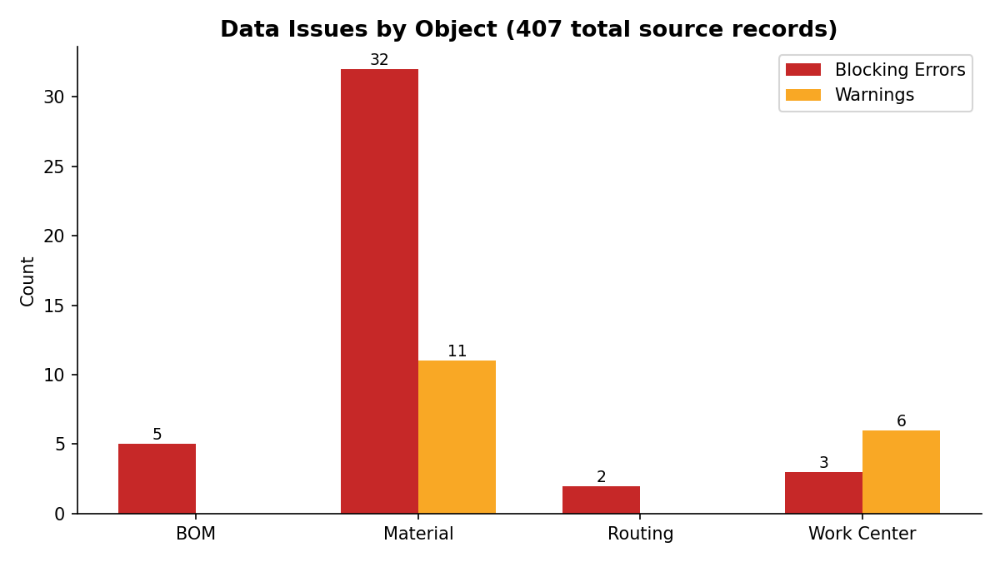
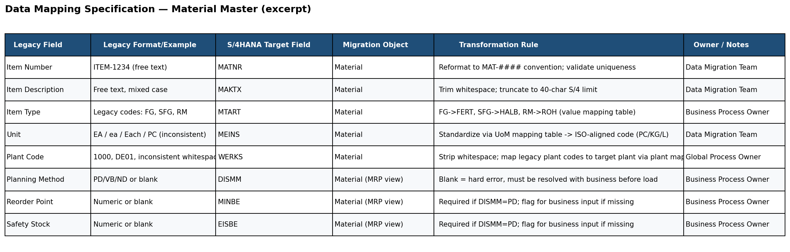

# SAP S/4HANA Material & Production Master Data Migration — Mock Implementation

**Python (pandas) · SAP S/4HANA Migration Cockpit concepts · Data Mapping & Validation · SAP PP Master Data**

A self-directed project simulating an end-to-end master data migration into SAP S/4HANA,
scoped to match a real Master Data Migration Expert role: Material Master, Bill of
Materials (BOM), Work Centers, and Routings.

## Why this project
Built to apply existing ETL/data-quality experience (SQL, Python, multi-source ERP
consolidation) directly to SAP S/4HANA migration methodology — data mapping,
transformation, referential-integrity validation, and migration readiness assessment —
using the same discipline SAP's Migration Cockpit enforces.

## Results at a glance



 

**Data Mapping Specification excerpt:**



## What's included

**1. Synthetic legacy dataset** (`data/legacy/`)
126 materials, 15 work centers, 149 BOM items, 123 routing operations — with deliberately
injected real-world defects: duplicate material numbers, inconsistent units of measure,
inconsistent plant coding, missing MRP-critical fields, and orphaned BOM/routing
references (components and work centers that don't exist).

**2. Data Mapping Specification** (`mapping/Data_Mapping_Specification.xlsx`)
Field-by-field legacy → S/4HANA target mapping across Material Master, BOM, Work Center,
and Routing, with documented transformation rules — the format used ahead of a real
Migration Cockpit load.

**3. ETL & validation pipeline** (`scripts/etl_transform.py`)
Cleans and standardizes the legacy data (UoM, plant codes, deduplication), applies the
mapping rules, and runs referential-integrity checks (e.g. every BOM component must
resolve to a valid material; every routing operation must resolve to a valid work
center) before producing migration-ready load files.

**4. Migration Readiness Scorecard** (`docs/migration_readiness_scorecard.md`)
Auto-generated report classifying every issue as a blocking error (must resolve before
load) or a warning (migrates, flagged for business review), with an overall readiness
percentage — mirroring the go/no-go checkpoint used before a real cutover.

**5. SAP PP domain reference** (`docs/sap_pp_reference.md`)
Working reference on Material Master views, BOM/Routing/Work Center structure, and the
object load sequence a real migration must respect.

## How to run it
```bash
python scripts/generate_legacy_data.py   # builds the messy legacy dataset
python scripts/etl_transform.py          # cleans, validates, produces migration-ready files + scorecard
python scripts/build_mapping_spec.py     # regenerates the mapping specification workbook
python scripts/generate_readiness_charts.py   # regenerates the readiness dashboard charts
python scripts/render_mapping_screenshot.py    # regenerates the mapping spec screenshot
```

## Sample result
Current run: **89.7% migration readiness** — 42 blocking errors and 17 warnings
identified across 407 source records, each traceable to a specific object and root
cause in the scorecard.

## Scope & honesty note
This is a self-directed simulation built to demonstrate migration methodology and
technical execution — it is not a claim of production SAP system experience. Legacy
data is synthetic. Field structures and migration object concepts (Material,
Bill of Material, Work Center, Routing) reflect standard, publicly documented SAP
terminology.
